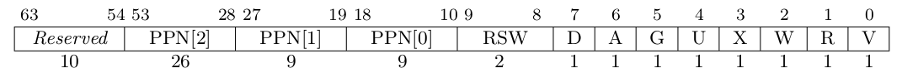

## 实现的功能
实现了用户态动态申请/释放内存空间的功能，具体如下：
- mmap 申请长度为指定字节大小的物理内存，将其映射到指定的虚存地址，并支持内存页度、写、执行属性
- munmap 取消申请的内存区域映射，并释放对应的内存空间

## 简答作业
### 1. 请列举 SV39 页表页表项的组成，描述其中的标志位有何作用？

SV39 页表页表项由以下4个部分组成
- `[64:54]` 这10位作为保留位
- `[53:10]` 这44位是物理页号
- `[9:8]`   留给操作系统使用，被硬件忽略
- `[7:0]`   是标志位

标志为的作用如下：
- V(Valid)：仅当位 V 为 1 时，页表项才是合法的；
- R(Read)/W(Write)/X(eXecute)：分别控制索引到这个页表项的对应虚拟页面是否允许读/写/执行；
- U(User)：控制索引到这个页表项的对应虚拟页面是否在 CPU 处于 U 特权级的情况下是否被允许访问；
- A(Accessed)：处理器记录自从页表项上的这一位被清零之后，页表项的对应虚拟页面是否被访问过；
- D(Dirty)：处理器记录自从页表项上的这一位被清零之后，页表项的对应虚拟页面是否被修改过。
### 2. 缺页
>缺页指的是进程访问页面时页面不在页表中或在页表中无效的现象，此时 MMU 将会返回一个中断， 告知 os 进程内存访问出了问题。
os 选择填补页表并重新执行异常指令或者杀死进程。
#### Q1：请问哪些异常可能是缺页导致的？
Exception Code 为
- 12 时发生指令缺页异常
- 15 时发生 store/AMO 缺页异常，
- 13 时发生 load 缺页异常
#### Q2：发生缺页时，描述相关重要寄存器的值
scause: 中断/异常发生时， CSR 寄存器 scause 中会记录其信息， Interrupt 位记录是中断还是异常， Exception Code 记录中断/异常的种类。
sstatus: 记录处理器当前状态，其中 SPP 段记录当前特权等级。
stvec: 记录处理 trap 的入口地址，现有两种模式 Direct 和 Vectored 。
sscratch: 其中的值是指向hart相关的S态上下文的指针，比如内核栈的指针。
sepc: trap 发生时会将当前指令的下一条指令地址写入其中，用于 trap 处理完成后返回。
stval: trap 发生进入S态时会将异常信息写入，用于帮助处理 trap ，其中会保存导致缺页异常的虚拟地址。

>缺页有两个常见的原因，其一是 Lazy 策略，也就是直到内存页面被访问才实际进行页表操作。 比如，一个程序被执行时，进程的代码段理论上需要从磁盘加载到内存。
但是 os 并不会马上这样做， 而是会保存 .text 段在磁盘的位置信息，在这些代码第一次被执行时才完成从磁盘的加载操作。

#### Q3：这样做有哪些好处？
节省内存空间，提升效率，避免不必要的磁盘加载操作

>其实，我们的 mmap 也可以采取 Lazy 策略，比如：一个用户进程先后申请了 10G 的内存空间， 然后用了其中 1M 就直接退出了。按照现在的做法，我们显然亏大了，
进行了很多没有意义的页表操作。
#### Q4：处理 10G 连续的内存页面，对应的 SV39 页表大致占用多少内存 (估算数量级即可)？
#### 请简单思考如何才能实现 Lazy 策略，缺页时又如何处理？
10G/512=20M
> 缺页的另一个常见原因是 swap 策略，也就是内存页面可能被换到磁盘上了，导致对应页面失效。

#### Q5：此时页面失效如何表现在页表项(PTE)上？
页面失效会将标志位`V`置为`0`。将置换出的物理页面保存在磁盘中，在之后访问再次触发缺页异常时将该页面写入内存。
### 3. 双页表与单页表

>为了防范侧信道攻击，我们的 os 使用了双页表。但是传统的设计一直是单页表的，也就是说， 用户线程和对应的内核线程共用同一张页表，只
> 不过内核对应的地址只允许在内核态访问。 (备注：这里的单/双的说法仅为自创的通俗说法，并无这个名词概念，详情见 KPTI )

#### Q1：在单页表情况下，如何更换页表？
用户线程切换时,更新stap寄存器的值，并设置内存屏障来更换页表
#### Q2：单页表情况下，如何控制用户态无法访问内核页面？
可以通过PTE的标志位来标识当前页表属于用户态还是内核态（如 `RISC-V``PTE` 的 U(User) 标志位），也可能通过固定地址区间区分，内核访问高地址，用户态只能访问低地址空间
#### Q3：单页表有何优势？（回答合理即可）
虚拟地址到物理地址转换更快
#### Q4：双页表实现下，何时需要更换页表？假设你写一个单页表操作系统，你会选择何时更换页表（回答合理即可）？
双页表实现下用户程序和内核转换时、用户程序转换时都需要更换页表，而对于单页表操作系统，不同用户线程切换时需要更换页表。
## 荣誉准则

1. 在完成本次实验的过程（含此前学习的过程）中，我曾分别与 以下各位 就（与本次实验相关的）以下方面做过交流，
   还在代码中对应的位置以注释形式记录了具体的交流对象及内容： 
   无
2. 此外，我也参考了 以下资料 ，还在代码中对应的位置以注释形式记录了具体的参考来源及内容： 
   [1] [rCore-Tutorial-Book 第三版](https://rcore-os.cn/rCore-Tutorial-Book-v3/index.html) 
   [2] [How to convert 'struct' to '&[u8]'?](https://stackoverflow.com/questions/28127165/how-to-convert-struct-to-u8) 
   [3] [可视化 Rust 各数据类型的内存布局](https://github.com/rustlang-cn/Rustt/blob/main/Articles/%5B2022-05-04%5D%20%E5%8F%AF%E8%A7%86%E5%8C%96%20Rust%20%E5%90%84%E6%95%B0%E6%8D%AE%E7%B1%BB%E5%9E%8B%E7%9A%84%E5%86%85%E5%AD%98%E5%B8%83%E5%B1%80.md) 

3. 我独立完成了本次实验除以上方面之外的所有工作，包括代码与文档。 我清楚地知道，从以上方面获得的信息在一定
   程度上降低了实验难度，可能会影响起评分。
4. 我从未使用过他人的代码，不管是原封不动地复制，还是经过了某些等价转换。 我未曾也不会向他人（含此后各届同学）
   复制或公开我的实验代码，我有义务妥善保管好它们。 我提交至本实验的评测系统的代码，均无意于破坏或妨碍任何
   计算机系统的正常运转。 我清楚地知道，以上情况均为本课程纪律所禁止，若违反，对应的实验成绩将按“-100”分计